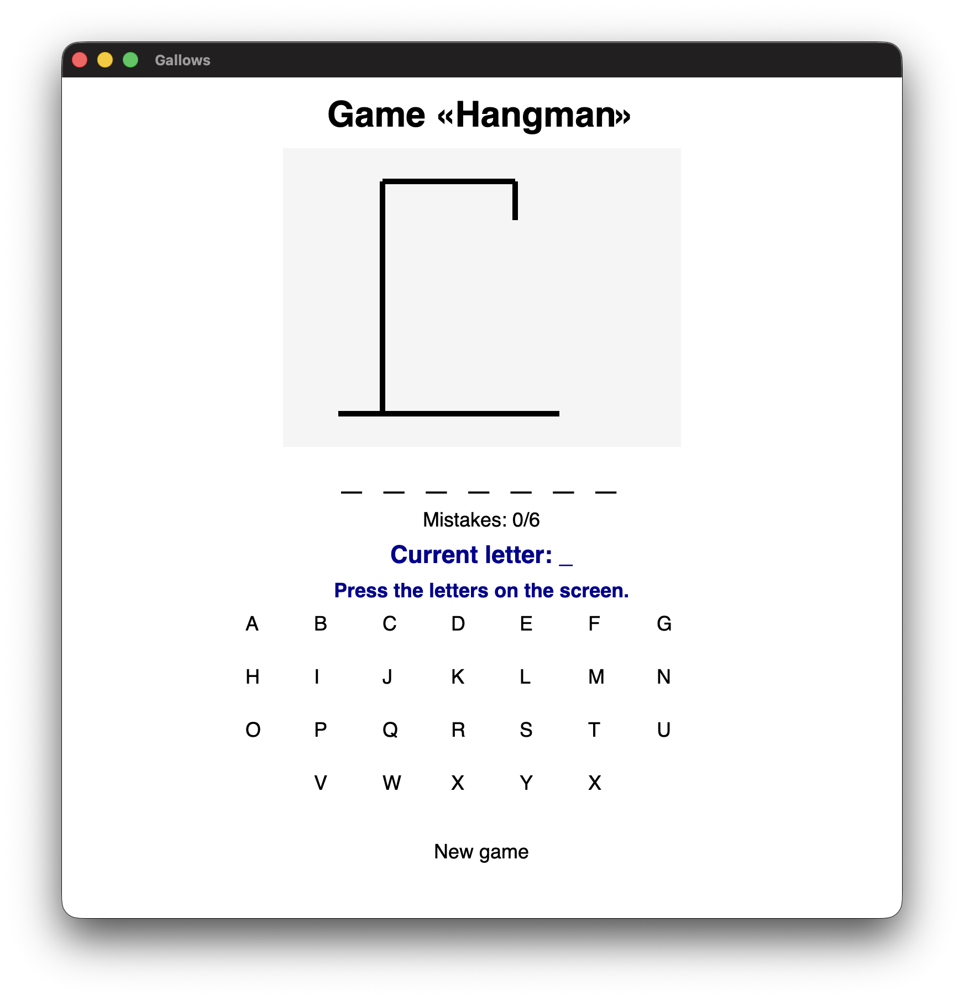
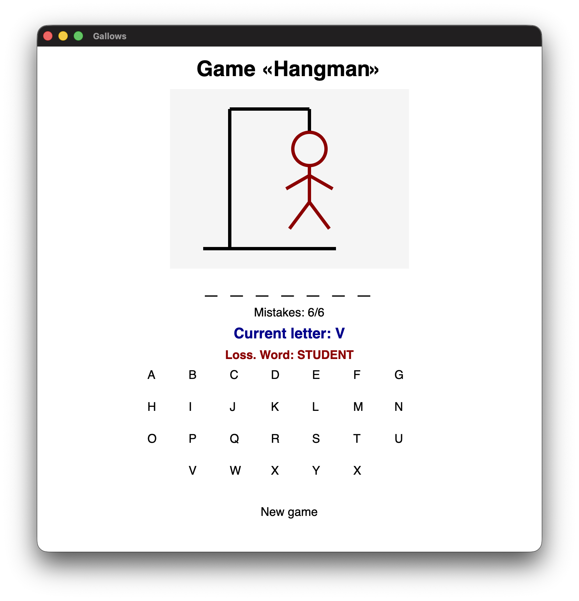
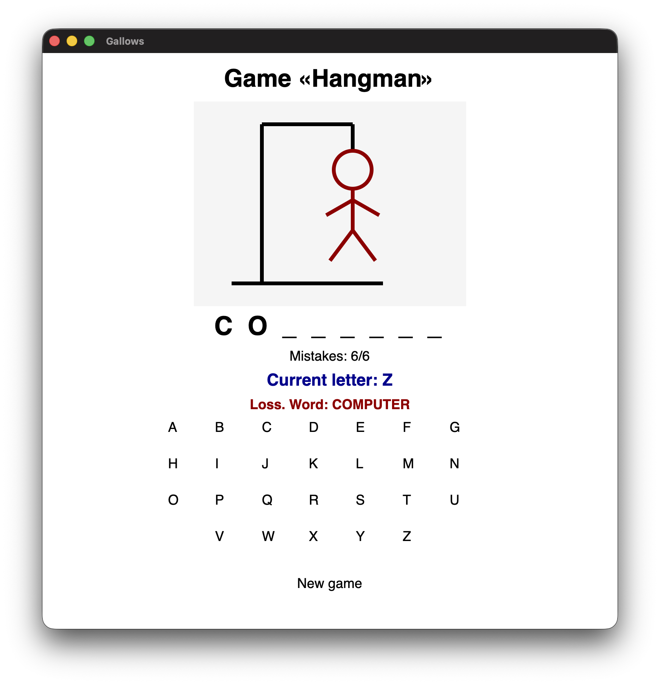

# Hangman Game in C#

## Description

Hangman Game is a C# desktop mini-game with a graphical interface built on Avalonia.
The player guesses a hidden word by pressing letters on the screen. Each wrong answer adds one mistake and draws a new part of the hangman figure.

## Features

1. Random word selection.
2. On-screen letter keyboard.
3. Display of the hidden word with guessed letters.
4. Mistake counter.
5. Hangman drawing that updates after every wrong guess.
6. Victory and loss messages.
7. New game button.
8. Cross-platform desktop interface using Avalonia.

## Installation and configuration

1. Clone repository

```bash
git clone https://github.com/selikon13/HangmanGame_Avalonia_NET10.git
cd HangmanGame_Avalonia_NET10
```

2. Restore dependencies

```bash
dotnet restore
```

3. Run project

```bash
dotnet run
```

## Controls

* Press letters on the screen to guess the word.
* Correct letters are opened in the hidden word.
* Wrong letters increase the mistake counter.
* The game ends after 6 mistakes.
* Press **New game** to restart.

## Screenshots
Start of the game

Loss game

Win game


## Technologies
* C#
* .NET 10
* Avalonia UI 11.3.7
* Avalonia.Desktop
* Avalonia.Themes.Fluent